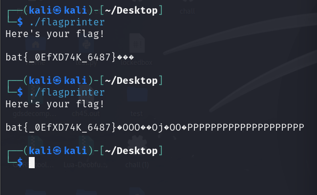
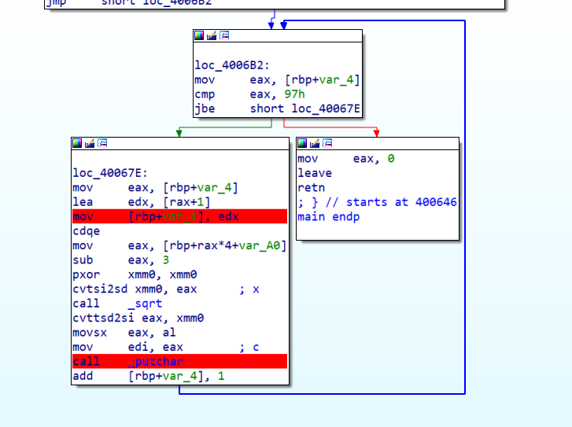
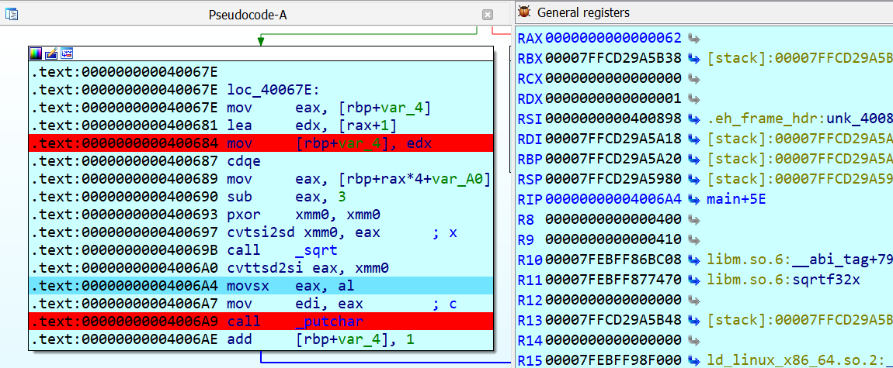
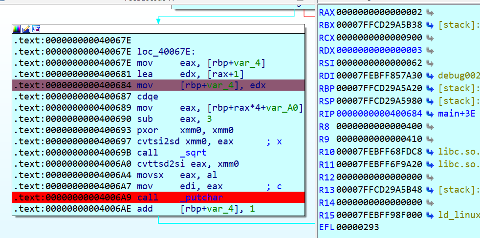
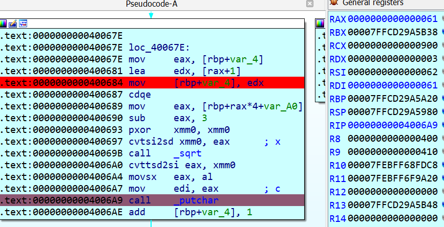

# Broken C code
## Overview

- Run thử => flag bị thiếu mất vài kí tự.

- Debug hàm main, bạn sẽ thấy `[rbp+var_4]` sẽ lưu số vòng lặp nó lại cũng như là length của string flag.
- Chạy xuống dưới thì edx đc truyền giá trị `[rax+1]` làm tăng 1 đơn vị `[rbp+var_4]`
=> điều này khiến lúc in flag bỏ qua 1 giá trị.

- Debug tiếp ta sẽ thấy rax là `0x62` => "b".

- Chạy thêm 1 vòng => ta sẽ thấy rõ edx làm tăng giá trị `[rbp+var_4]`.
=> khiến program trỏ đến kí tự `i+2` chứ kp là `i+1`.
=> program sẽ in ra "a" chứ không phải "c" theo format.

## Solution
=> Ta chỉ cần chỉnh rdx giảm 1 đơn vị là xong.

# XOR
```
enc = [0x21, 0x0F, 0x0A, 0x15, 0x3F, 0x29, 0x29, 0x6B, 0x13, 0x1C, 0x2C, 0x74, 0x7D, 0x30, 0x5E, 0x50, 0x6E, 0x29, 0x2B, 0x24, 0x19, 0x0C, 0x67, 0x7D, 0x05, 0x54, 0x7C, 0x34, 0x5C, 0x13, 0x32, 0x42, 0x29, 0x62, 0x7B, 0x0F, 0x4E]
cipher = "ClkvKOR8JQA1JB731LeGkU7J4d2khDvrOPI63mM7"
flag = ""
for i in range(len(enc)):
    flag += chr(enc[i] ^ ord(cipher[i]))
print(flag)
```